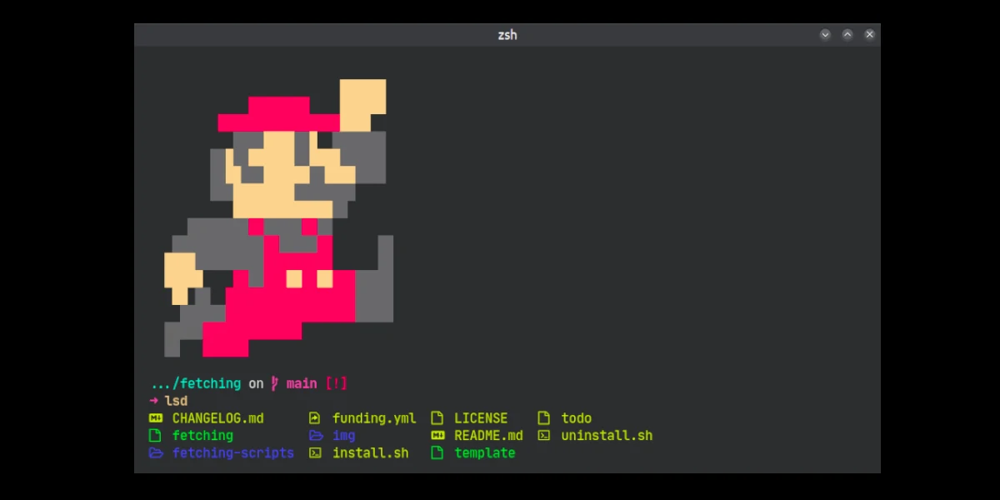

### Julian Martinez: Bio

I'm a software consultant and product support aficionado living in San Francisco, California.

I've used React a lot and AWS, especially AWS Amplify and its associated services: s3, Cognito, DynamoDB, and AppSync. These days, I use Svelte more. 

I also use Linux (Ubuntu), the i3 window manager, and switch between vim and Emacs.

I like to code, run and read science fiction. I'm reading Code, by Petzold, now. 

I'm on Hacker News and Indie Hackers, if you read those. 

Also, I'm friendly. Say hi!

