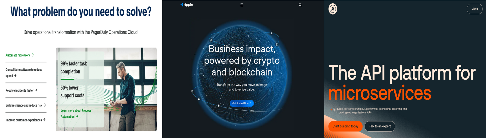

## About Me

I'm Julian Martinez, @julianeon on most platforms.

I'm a technical support engineer. On the side, I own an online business, a monetized YouTube channel.

At my consultancy, Excelsitor, I focus on social media, landing pages, software prototypes and program management. I frequently use AWS for this.

I did contractual technical support at [Block](https://www.linkedin.com/in/julianeon/). I also did technical support as an employee at Apollo GraphQL, Ripple and PagerDuty, mostly [product support](product_support.md). 

You can read my [repo guide](repo_guide.md) to learn more about my GitHub code and see [examples](https://javascriptpage.com/react-svelte-pitch-deck-app-comparison) of my writing on my [JavaScriptPage](https://javascriptpage.com) site. 

Languages I've used: [JavaScript](repo_guide.md), [Ruby](https://github.com/julianeon/useful-ruby-scripts), [Python](https://github.com/julianeon/slackbot), Go, [Rust](https://github.com/julianeon/moodtracker/tree/main), [Lisp](https://gist.github.com/julianeon/11f71c1a860c292b1699a9f75a6c3e0e) and C.

I'm [Linux Essentials](https://www.lpi.org/our-certifications/exam-010-objectives) certified. I'm proficient with the command line and bash.

## Interests 

I like coding, [running](https://goldengaterunningclub.org/), [books](books.md) and bodyboarding.

I also like to hunt for good repos here, like this one on [complex systems](https://github.com/ByteByteGoHq/system-design-101).

Speaking of repos, I keep my personal todo list on GitHub (private), which is why I'm active now almost every day.

You can say hi, on Telegram or Discord, at @julianeon.

<h2 align="left">Languages and Tools</h2>

<a href="https://developer.mozilla.org/en-US/docs/Web/JavaScript" target="_blank"> 
<a href="https://reactjs.org/" target="_blank"> 

