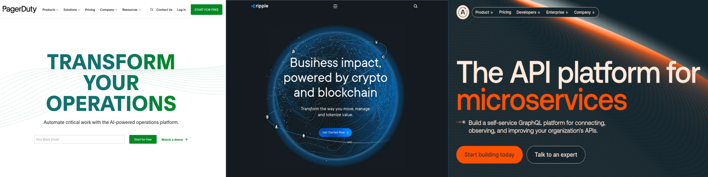

## About Me

I'm Julian Martinez, @julianeon on most platforms.

I'm a software consultant and product support aficionado living in San Francisco, California. I'm big on [product support](product_support.md).

I did technical support at PagerDuty, Ripple, and Apollo GraphQL (see: [LinkedIn](https://www.linkedin.com/in/julianeon/). After that I worked at my consultancy, Excelsitor, on cryptocurrency projects.

In terms of crypto, using the Graph protocol, you can see my [subgraph](https://github.com/julianeon/cronos) for the Cronos ERC-20 token, this [app](https://github.com/julianeon/cronos-graph) to display Cronos data using that subgraphfor its data, and this [app](https://github.com/julianeon/subgraph-sepolia-mkt) displaying data for a newly created token deployed on Ethereum's Sebolia testnet.

You can read my [repo guide](repo_guide.md) to learn more about my GitHub code.

You can see [examples of my writing](https://javascriptpage.com/react-svelte-pitch-deck-app-comparison) about JS on my [JavaScriptPage](https://javascriptpage.com) site. 

Languages I've used: [JavaScript](repo_guide.md), [TypeScript](https://github.com/julianeon/userform), [Python](https://github.com/julianeon/slackbot), [Ruby](https://github.com/julianeon/useful-ruby-scripts), [Bash](https://github.com/julianeon/useful-bash-scripts), [Rust](https://github.com/julianeon/moodtracker/tree/main), Go, Perl, [Lisp](https://gist.github.com/julianeon/11f71c1a860c292b1699a9f75a6c3e0e). 

I'm proficient with the command line and I'm [Linux Essentials](https://www.lpi.org/our-certifications/exam-010-objectives) certified. 

## Interests 

I'm on [Hacker News](https://news.ycombinator.com/) and [Indie Hackers](https://indiehackers.com). 

I like coding, [running](https://goldengaterunningclub.org/) (former member) and [reading](books.md).

I also like to hunt for good repos on here and on GitLab, like this one on [complex systems](https://github.com/ByteByteGoHq/system-design-101).

Also, I'm friendly. Say hi, on Telegram or Discord, at @julianeon.

<h2 align="left">Languages and Tools</h2>

<a href="https://developer.mozilla.org/en-US/docs/Web/JavaScript" target="_blank"> 
<a href="https://reactjs.org/" target="_blank"> 

