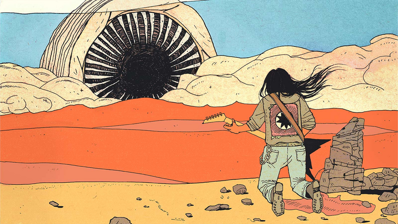

## Books

Here is a list of books I've read and enjoyed.

I recommend all these books.

### Fiction

I'm a big fan of Phillip K. Dick and his best books - Man In The High Castle, and Ubik, especially.

Also greatly enjoyed LOTR and Dune.

Two books that I loved that I rarely see mentioned are Bodard's Obsidian & Blood series & Garfinkel's All Of An Instant.

On the more literary side: In Search of Lost Time, War and Peace, Moby Dick.

Also read Vol. 1 of The Arabian Nights (1 of 3) and will finish at least one more.

### Nonfiction

For a history of tech, Fire In The Valley is outstanding.

I learned a lot from Global Capitalism, by Freidan.

I also thought the Penguin History of the World was great, for what it is.

I thought The Chosen by Karabel was incredible, a history of American university admissions.

The Making of the Atomic Bomb by Rhodes is great too.

On a psychological note: Barrett's How Emotions Are Made was transformative.

