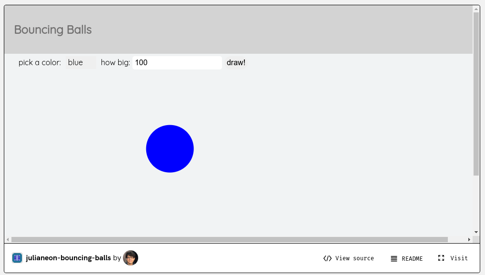
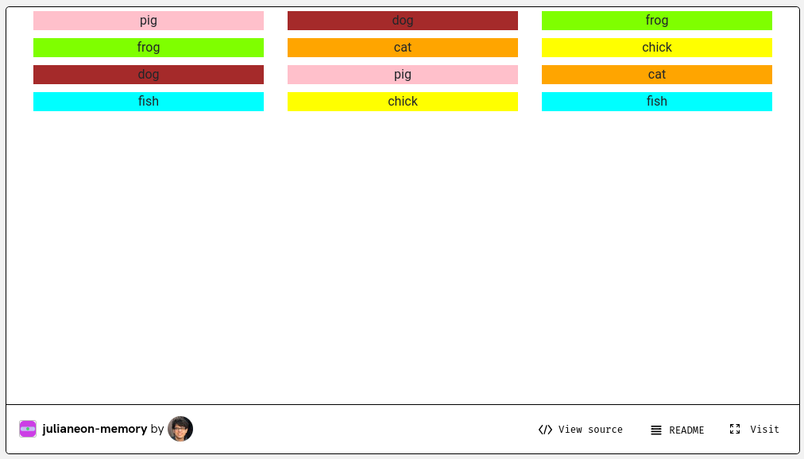

# Repo Guide

This is a guide to my repositories on Glitch, linked to from my [repo page](./repo_guide.md). 

I have 16 JavaScript apps on [Glitch](https://glitch.com) at [glitch.com/@julianeon](https://glitch.com/@julianeon). 

Each app, when you click on it, will take 1-3 minutes to load. 

By reading this guide, you can get a sense of what you'll see after it loads, to decide if it's worth the wait.

On each app's page, the demo will be shown in a window at the top while the code will be accessible through a link ("View Source") towards the bottom.

The apps are linked below, with descriptions and screenshots taken after loading.

# bouncing balls 

In this app, you select the color of the ball and enter a number for the size in pixels of the ball (I suggest 100). It will then bounce onto the screen, using that size and color.

[julianeon-bouncing-balls glitch link](https://glitch.com/~julianeon-bouncing-balls)

# memory game

In this app, you can click on squares to uncover names briefly, as in the card game of memory. When you click the same name on different squares consecutively, the word pair stays uncovered. When you uncover all the names, you win.

[julianeon-memory glitch link](https://glitch.com/~julianeon-memory)

