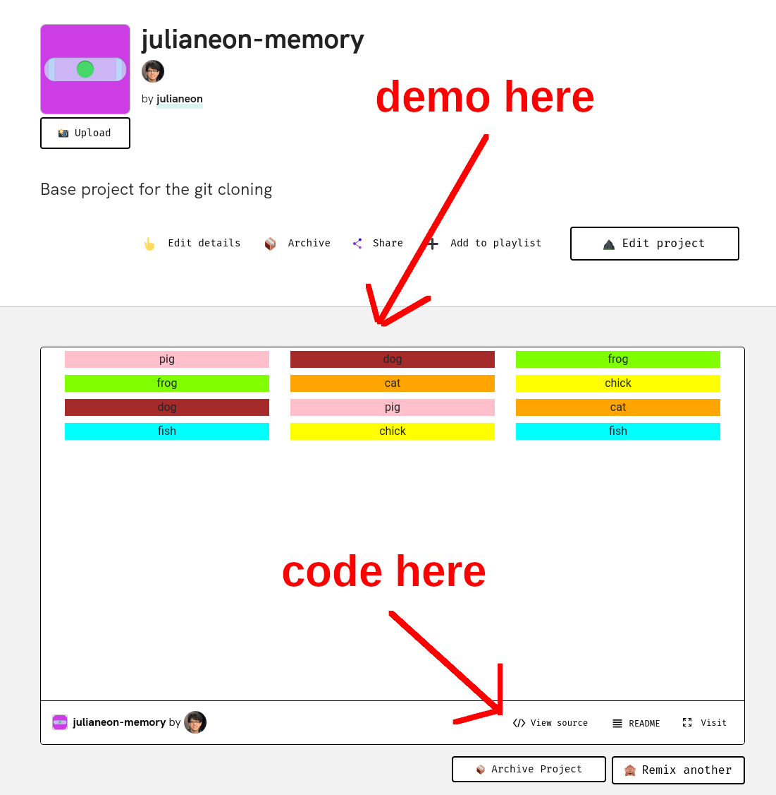

# Glitch Guide

This is a guide to my repositories on Glitch, linked to from my [repo page](./repo_guide.md). 

I have 16 JavaScript apps on [Glitch](https://glitch.com) at [glitch.com/@julianeon](https://glitch.com/@julianeon).  I created each of them from scratch; none are copies, or forks, of other code.

Each app, when you click on it, will take 1-3 minutes to load. 

By reading this guide, you can get a sense of what you'll see after it loads, and decide if it's worth the wait.

On each app's page, the demo will be shown in a window at the top while the code will be accessible through a link ("View Source") towards the bottom.

The apps are shown below in the same order they appear in on my Glitch profile page, with descriptions and screenshots taken after loading.

## bouncing balls 

In this app, you select the color of the ball and enter a number for the size in pixels of the ball (I suggest 100). A ball will then bounce onto the screen, of that size and color.

[julianeon-bouncing-balls](https://glitch.com/~julianeon-bouncing-balls)

## circles

In this app, a circle within a circle appears on the screen, and it flashes a different colored circle within a few seconds, alternating between these two circle pairs.

[julianeon-circles](https://glitch.com/~julianeon-circles)

## memory game

In this app, you can click on squares to uncover names briefly, as in the card game of memory. 

When you click the same name on different squares consecutively, the word pair stays uncovered. 

When you uncover all the names, you win.

[julianeon-memory](https://glitch.com/~julianeon-memory)

## whale smallify

In this app, you click on the whale, and it decreases in size, second by second, until it disappears.

[julianeon-whale-smallify](https://glitch.com/~julianeon-whale-smallify)

## striper

In this app, stripes of different text cris-cross the screen, with text in the center.

[julianeon-striper](https://glitch.com/~julianeon-striper)

## shrimp

In this app, each time you click on the button, the shrimp rotates a random amount, and the click count increases by 1.

[julianeon-shrimp](https://glitch.com/~julianeon-shrimp)

## hot take machine

In this 'magic 8 ball' app, you ask a question and receive a 'yes' or 'no' answer.

[julianeon-hot-take-machine](https://glitch.com/~julianeon-hot-take-machine)

## text scroll

In this app, text scrolls sideways across the screen.

[julianeon-text-scroll](https://glitch.com/~julianeon-text-scroll)

## invisible

In this app, you mouse the app over the upper half of the image, and hidden text appears.

[julianeon-invisible](https://glitch.com/~julianeon-invisible)

## vision test

In this app, you enter text to magnify, and it appears in a very large text size on the screen.

[julianeon-visiontext](https://glitch.com/~julianeon-visiontest)

## chatter

In this app, a party chat is simulated. 

Important: scroll down in the iframe after the app loads to find the red button. You must click this to advance the text.

[julianeon-chatter](https://glitch.com/~julianeon-chatter)

## stacker

In this app, text is stacked across a boldly colored screen.

[julianeon-stacker](https://glitch.com/~julianeon-stacker)

## svger

In this app, images are combined with text, as in a slideshow, you can click through to the end.

[julianeon-svger](https://glitch.com/~julianeon-svger)

## red no

In this app, a red letter 'no' flashes across the screen, with more punctuation and urgency over time.

[julianeon-redno](https://glitch.com/~julianeon-redno)

## team cards

In this app, a professional looking 'teams' section is simulated, showcasing the design and changed text when you click on an image.

[julianeon-team-cards](https://glitch.com/~julianeon-team-cards)

## redacted

In this app, you can click on individual words to 'redact' them, or replace them inline with a black bar.

[julianeon-redacted](https://glitch.com/~julianeon-redacted)

