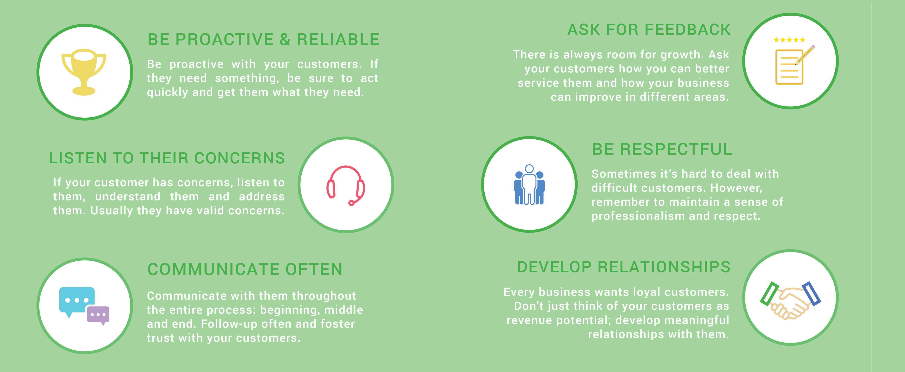

## Product Support

Product support is what I've spent most of my career in tech doing. I care deeply about it.

In my view, helping customers isn't just about solving problems, but also about being an expert guide who helps them get the best out of the technology we make for them. It's not just about the software; it's also about making sure people feel happy and confident using it.

My guiding principles are simple: be kind and solve problems thoroughly. 

Being kind means really listening to what our customers are saying, understanding that when things go wrong it can be frustrating, and reassuring them that I'm here to help without ever losing control of my tone (or my temper). It means respecting their feelings and experiences, and making sure they know I'm on their side. 

A good solution isn't just technically right; it's also explained in a way that makes sense to the person using our product, without condescension or, at the other extreme, too much technical detail.

Being proactive, or getting ahead of problems before they even start, is also key. This might mean creating guides or FAQs that customers can use to solve common issues on their own, which saves them from having to reach out in the first place. It might also mean [writing scripts](https://gist.github.com/julianeon?direction=desc&sort=created) to demonstrate something product-related.

In short, my job in support is not just about fixing things, but also about being a friendly, understanding helper who makes using our product a smooth experience. 

## Support Protocols

At one level, support is about doing the work of answering customer questions and making sure everything is resolved to their satisfaction. 

At a minimum, there should be a system in place to register all requests, and make sure they're all responded to in a timely fashion. For me, that system was usually Zendesk.

The danger of a system like that, especially if it's processing a large number of requests, is that everyone can become a number. 

I agree with [Zendesk](https://cxtrends.zendesk.com/trends/trend-3) that businesses should personalize support. 

_Here’s what Zendesk’s research illuminated: most companies hold a rather narrow view of what personalization means, which is at odds with the 62 percent of consumers who think these businesses could be doing more. These customers don’t want to be lumped into some demographic bucket—they crave experiences in which they’re a segment of one, not thousands._

_Think of it like the barista who greets you by your name, starts whipping up your normal order, and then asks a follow up question about something you talked about during your last visit._

I think it's important to make every customer feel heard, by asking the right questions, responding quickly enough for the conversation to feel alive, and making sure the resolution is something the customer can accept and, more than that, feel positive about by the end.

This [infographic](https://fieldedge.com/blog/guide-to-great-customer-service-infographic/) lays down good rules for customer service that I follow in my work.

I also try to be specific and give steps to follow in my response, as shown in Situation #2 [here](https://quick-answers.kronis.dev/).

## Next Level Support

To provide truly next level customer service, I believe the whole company has to be involved. 

Support receives the requests from the users and answer them, but Product also needs to be involved to prioritize the feature requests and user experience overall. Whenever I notice patterns or repeated issues, I make sure to let Product team know. With the right leadership, the company can make updates or changes that prevent those issues from happening again.

It's also good for Support to talk to Sales, too, to know what the most important customers might not write in about but are thinking and saying in meetings, especially if it's a feature multiple users are asking repeatedly about.  

This is a good introduction to my approach to product support, but I'm happy to explain more upon request.

