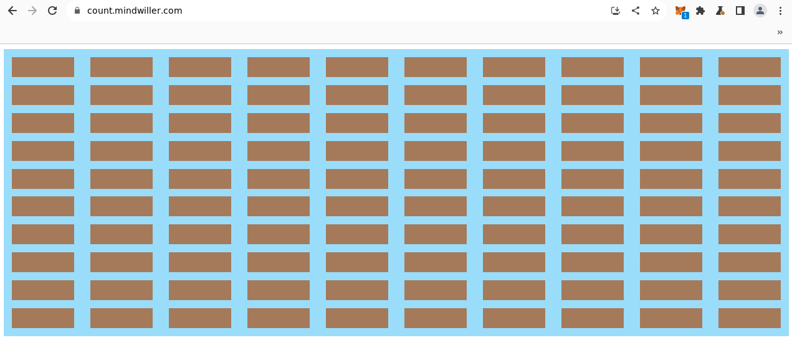
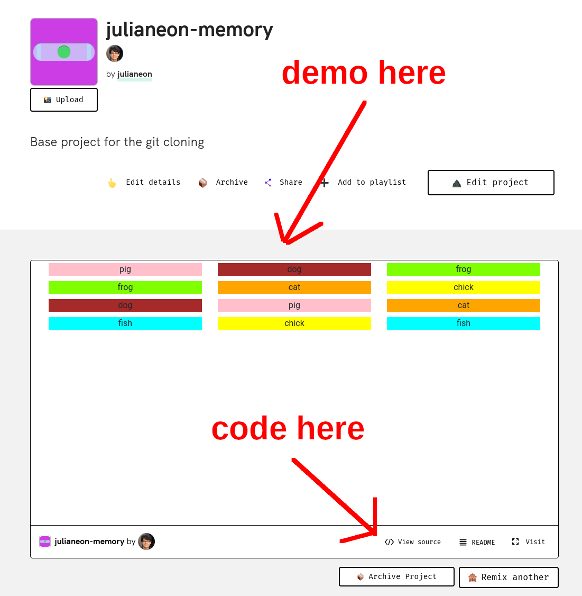
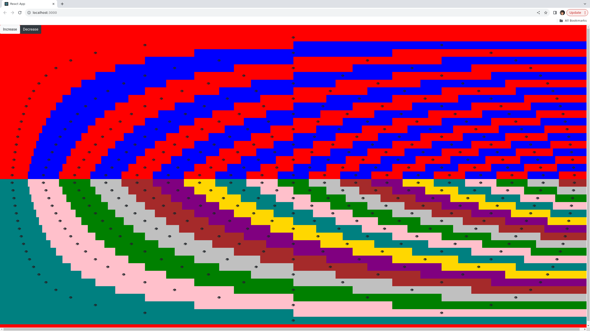

## Repo Guide

This is a guide to my repositories on GitHub, linked to from my [profile](./README.md). 

Most of my repos are web apps made with JavaScript. Most of the recent ones are made with React, though I can just as easily work with Next.js or Svelte. 

To see a recent example of a React template I customized for a landing page, see [React-Landing-Page-Learn React](https://github.com/julianeon/React-Landing-Page-Learn-React).

This is the live (demo) version of that repo, which I'm hosting on s3 on AWS:

http://react-landing-page-learn-react.s3-website-us-east-1.amazonaws.com/

Many of my repos are one-shot apps used to display a visual or demonstrate a concept and were created over 1-3 days.

_Example: click on a box to make it disappear at [count.mindwiller.com](https://count.mindwiller.com)._

Repos with 'react' in the name were made with React, using hooks. 

I host almost all my apps, once complete, on AWS.

Here's an example made with Svelte: [hometoolzone.com](https://www.hometoolzone.com/)

I have completed more advanced apps with authentication and access to various AWS services such as AppSync, but those aren't here since they can't be run locally as easily as an app without AWS credentials. I can share that code upon request.

You can see demos of 16 of my JavaScript apps on [Glitch](https://glitch.com) at [glitch.com/@julianeon](https://glitch.com/@julianeon). Be aware that they take 1-3 minutes to load. Once they do, you'll see the demo and a link to the code in the tab.

The example shown below is [julianeon-memory](https://glitch.com/~julianeon-memory).

For several of my other JS apps (not on Glitch), I wrote up explanations of the code and what it does on [javascriptpage.com](https://javascriptpage.com). 

For easier access, I'm listing repos with demos and JavaScriptPage writeups (when available) below.

psychedelic-eye: [demo](http://psychedelic-eye.s3-website-us-east-1.amazonaws.com), [code](https://github.com/julianeon/psychedlic-eye), [writeup](https://javascriptpage.com/react-psychedelic-eye-art) (best viewed on desktop - turn your phone sideways on mobile).

pitch-deck-react: [demo](http://pitch-deck-react.s3-website-us-east-1.amazonaws.com/), [code](https://github.com/julianeon/pitch-deck-react/), [writeup](https://javascriptpage.com/react-svelte-pitch-deck-app-comparison).

pitch-deck-svelte: [demo](http://pitch-deck-svelte.s3-website-us-east-1.amazonaws.com/), [code](https://github.com/julianeon/pitch-deck-svelte/), [writeup](https://javascriptpage.com/react-svelte-pitch-deck-app-comparison).

blog-basic-react: [demo](https://blog-basic.s3.amazonaws.com/index.html), [code](https://github.com/julianeon/blog-basic-react), [writeup](https://javascriptpage.com/building-simple-blog-using-react).

react-state-router: [demo](http://reactstate.s3-website-us-east-1.amazonaws.com/), [code](https://github.com/julianeon/react-state-router), [writeup](https://javascriptpage.com/react-state-routing).

javascript-get-request: [demo](https://javascriptpage.com/react-state-routing), [code](https://gist.github.com/julianeon/d4c9fe06ad991ad81dd071edb98bb1f9), [writeup](https://javascriptpage.com/javascript-get-request-example).

react-landing-page-learn-react: [demo](http://react-landing-page-learn-react.s3-website-us-east-1.amazonaws.com/), [code](https://github.com/julianeon/React-Landing-Page-Learn-React).

