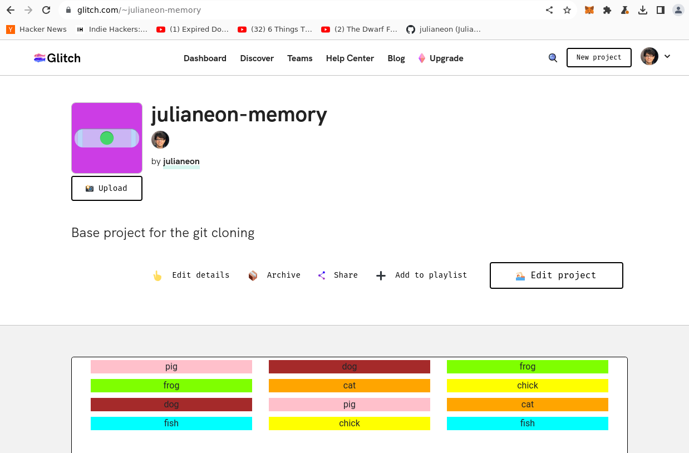

## Repo Guide

### Introduction

This is a guide to my repositories on GitHub, linked to from my [profile](./README.md). 

Most of my repos are web apps made with JavaScript. This reflects the fact that, as a consultant, I mostly used React with AWS, especially AWS Amplify and its associated services: s3, Cognito, DynamoDB, AppSync, API Gateway and Lambda.

For other languages, I either have one repo here with various scripts, or a longer demo program.

[Python](https://github.com/julianeon/slackbot), [Ruby](https://github.com/julianeon/useful-ruby-scripts), [TypeScript](https://github.com/julianeon/userform), [Rust](https://github.com/julianeon/moodtracker/tree/main), [Bash](https://github.com/julianeon/useful-bash-scripts)

### JavaScript

Most of my JavaScript apps are React apps. If you'd like to read my writing about JavaScript, see [JavaScriptPage](https://javascriptpage.com).

To see a recent example of a React template I customized for a landing page, see [React-Landing-Page-Learn React](https://github.com/julianeon/React-Landing-Page-Learn-React).

This is the live (demo) version of that repo, which I'm hosting on s3 on AWS:

http://react-landing-page-learn-react.s3-website-us-east-1.amazonaws.com/

Many of my repos are one-shot apps used to display a visual or a concept and were created over 1-3 days.

_Example: click on a box to make it disappear at [count.mindwiller.com](https://count.mindwiller.com)._

Repos with 'react' in the name were made with React, using hooks. 

I host the apps that aren't made for local use on AWS. Here's an example made with Svelte: [hometoolzone.com](https://www.hometoolzone.com/)

I've made apps with authentication that use AWS services like AppSync, but those aren't here since they can't be run locally as easily as an app without AWS credentials. I can share that code upon request.

### Demos

You can see demos of 16 of my JavaScript apps on [Glitch](https://glitch.com) at [glitch.com/@julianeon](https://glitch.com/@julianeon). Be aware that they take 1-3 minutes to load. Once they do, you'll see the demo and a link to the code towards the bottom of the page.

Read my [Glitch guide](./glitch_guide.md) for screenshots of the demos hosted there, if you'd rather see what they do before selecting one, or want to see what they look like without waiting.

The Glitch example shown below is [julianeon-memory](https://glitch.com/~julianeon-memory).

For several of my other JS apps (not on Glitch), I wrote up explanations of the code and what it does on [javascriptpage.com](https://javascriptpage.com). 

For easier access, I'm linking repos with demos and JavaScriptPage writeups (when available) below.

psychedelic-eye: [demo](http://psychedelic-eye.s3-website-us-east-1.amazonaws.com), [code](https://github.com/julianeon/psychedlic-eye), [writeup](https://javascriptpage.com/react-psychedelic-eye-art) (best viewed on desktop - turn your phone sideways on mobile).

pitch-deck-react: [demo](http://pitch-deck-react.s3-website-us-east-1.amazonaws.com/), [code](https://github.com/julianeon/pitch-deck-react/), [writeup](https://javascriptpage.com/react-svelte-pitch-deck-app-comparison).

pitch-deck-svelte: [demo](http://pitch-deck-svelte.s3-website-us-east-1.amazonaws.com/), [code](https://github.com/julianeon/pitch-deck-svelte/), [writeup](https://javascriptpage.com/react-svelte-pitch-deck-app-comparison).

blog-basic-react: [demo](https://blog-basic.s3.amazonaws.com/index.html), [code](https://github.com/julianeon/blog-basic-react), [writeup](https://javascriptpage.com/building-simple-blog-using-react).

react-state-router: [demo](http://reactstate.s3-website-us-east-1.amazonaws.com/), [code](https://github.com/julianeon/react-state-router), [writeup](https://javascriptpage.com/react-state-routing).

javascript-get-request: [demo](https://javascriptpage.com/react-state-routing), [code](https://gist.github.com/julianeon/d4c9fe06ad991ad81dd071edb98bb1f9), [writeup](https://javascriptpage.com/javascript-get-request-example).

react-landing-page-learn-react: [demo](http://react-landing-page-learn-react.s3-website-us-east-1.amazonaws.com/), [code](https://github.com/julianeon/React-Landing-Page-Learn-React).

